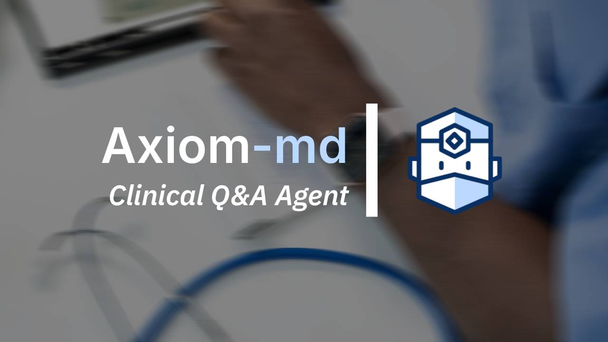

# axiom-md

> A clinical Q&A agent that answers questions across conditions, interventions, and evidence — built for researchers, clinicians, and health-curious developers.


---

## What it does

`axiom-md` is a LangChain-powered CLI agent that answers structured clinical questions across a wide range of disease areas and interventions. It is designed to mirror how a knowledgeable clinician reasons through evidence: starting with a question, identifying relevant terminology, and synthesizing answers from authoritative sources.

Ask it about a drug-condition interaction, a diagnostic criterion, a common patient question, or an evidence gap — it routes the query, retrieves relevant context, and returns a structured, sourced answer.

---

## Key features

- **Multi-domain clinical Q&A** — handles questions across conditions (common to rare), interventions, diagnostics, and patient-facing topics
- **Structured output** — answers include condition name, relevant clinical ontology codes (ICD-10, RxNORM, LOINC where applicable), evidence summary, and source citations
- **PubMed integration** — retrieves abstracts from PubMed for evidence-backed responses
- **Ontology-aware** — maps clinical concepts to standard terminologies to support downstream search and retrieval
- **Extensible pipeline** — designed to be swapped into larger evidence generation workflows

---

## Example interaction

```
$ python agent.py

axiom-md > What are the first-line treatments for type 2 diabetes in adults?

Agent: Querying clinical knowledge base...

Condition: Type 2 Diabetes Mellitus
ICD-10: E11
RxNORM (first-line agents): 860975 (metformin), 4815 (glipizide)

Summary: Current guidelines recommend metformin as the preferred initial
pharmacologic agent for most adults with type 2 diabetes, absent
contraindications. GLP-1 receptor agonists or SGLT-2 inhibitors are
recommended when cardiovascular or renal comorbidities are present.

Sources:
- ADA Standards of Care in Diabetes (2024)
- PubMed: PMID 38078584

axiom-md >
```

---

## Architecture

```
User query (CLI)
      │
      ▼
 LangChain agent
      │
      ├──► Clinical knowledge base (local structured Q&A library)
      │
      ├──► PubMed API (abstract retrieval via Entrez)
      │
      └──► Ontology mapper (ICD-10 / RxNORM / LOINC lookup)
             │
             ▼
     Structured response
     (condition, codes, summary, sources)
```

---

## Tech stack

| Layer | Technology |
|---|---|
| Agent framework | LangChain |
| LLM | OpenAI GPT-4o |
| Literature retrieval | PubMed Entrez API (Biopython) |
| Ontology mapping | Custom ICD-10 / RxNORM lookup layer |
| Interface | Python CLI |

---

## Getting started

**Prerequisites**

- Python 3.10+
- OpenAI API key

**Install**

```bash
git clone https://github.com/yourusername/axiom-md.git
cd axiom-md
pip install -r requirements.txt
```

**Configure**

```bash
cp .env.example .env
# Add your OPENAI_API_KEY to .env
```

**Run**

```bash
python agent.py
```

---

## Project status

Active development. Core Q&A pipeline and PubMed retrieval are functional. Ontology mapping layer and structured output schema are in progress.

Planned:
- [ ] Expanded clinical Q&A library across 50+ conditions
- [ ] LOINC code mapping for lab and diagnostic queries
- [ ] Metatag output for search and retrieval integration
- [ ] ClinicalTrials.gov integration for active trial retrieval
- [ ] Export to structured JSON / markdown for downstream pipeline use

---

## Motivation

This project began as an exploration of LangChain agents for multi-domain Q&A. As the architecture matured, the focus shifted toward clinical evidence — a domain where the need for structured, sourced, rapidly retrievable answers is acute. `axiom-md` is designed as a building block for larger evidence generation pipelines, not a standalone clinical decision support tool.

This project does not provide medical advice and is not intended for clinical use.

---

## Related projects

- [`auris`](https://github.com/yourusername/auris) — HIPAA-aware voice pipeline for clinical call transcription and structured outcome extraction
- [`priorx`](https://github.com/yourusername/priorx) — RAG-powered clinical evidence prioritization engine

---

## License

MIT